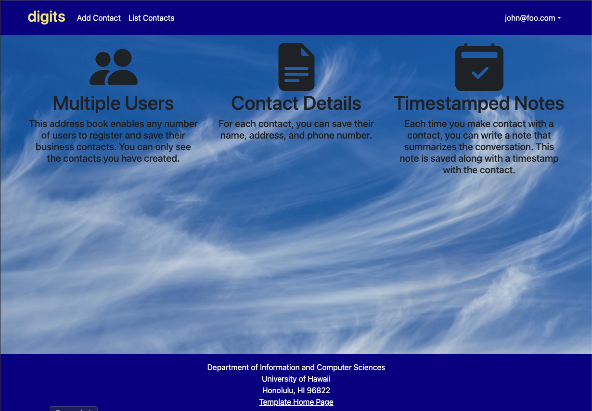
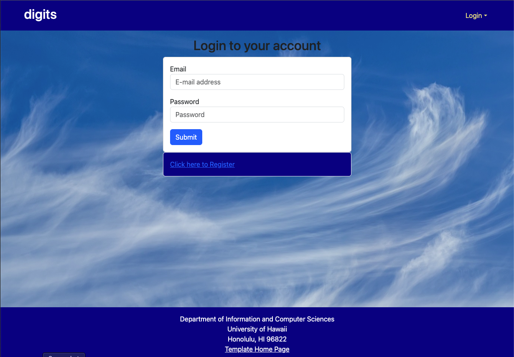
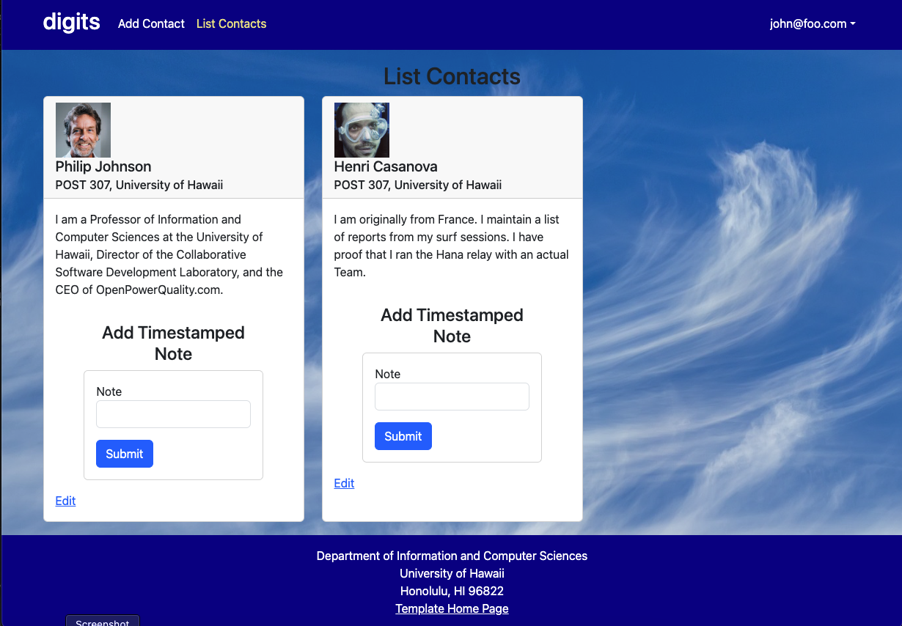
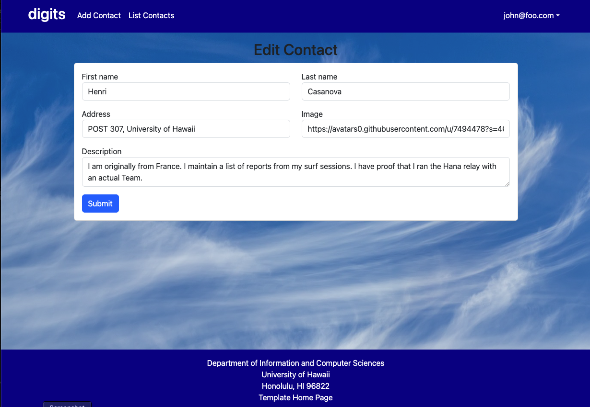
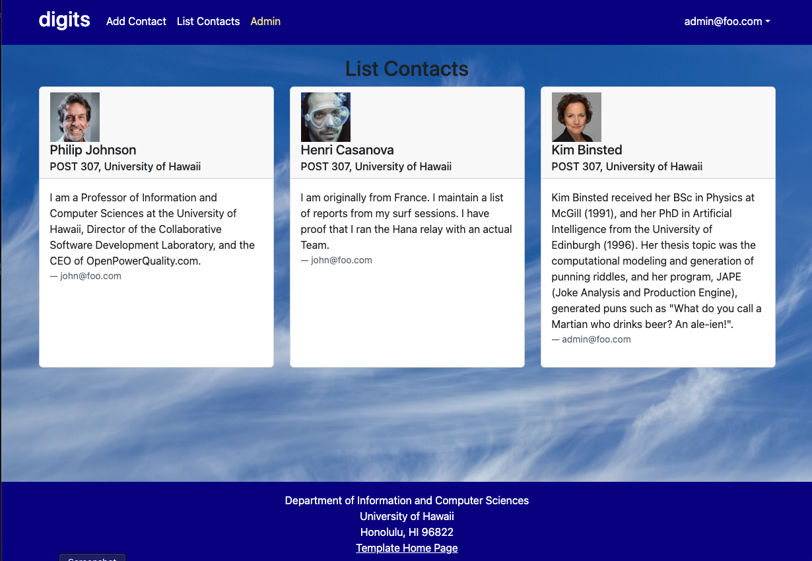

Digits is an application where users can

* Register an account
* Create and manage contacts
* Add timestamped notes for their interactions with each contact


## Installation

First, [install Meteor](https://www.meteor.com/install).

Then, download a copy of Digits (please note that Digits is a private repo, so you will need to request permission first).

Now, cd into the app directory to install the required libraries

```
$ meteor npm install
```

## Running the system

Once the libraries are installed, you can run the application using:

```
$ meteor npm run start
```

The first time you run the app, it will create some default users and data. Here is a sample output:

```


=> Started proxy.
=> Started MongoDB.
I20180305-18:06:02.764(-10)? Creating the default user(s)
I20180305-18:06:02.803(-10)?   Creating user admin@foo.com.
I20180305-18:06:02.803(-10)?   Creating user john@foo.com.
I20180305-18:06:02.804(-10)? Creating default contacts.
I20180305-18:06:02.804(-10)?   Adding: Johnson (john@foo.com)
I20180305-18:06:02.804(-10)?   Adding: Casanova (john@foo.com)
I20180305-18:06:02.804(-10)?   Adding: Binsted (admin@foo.com)
=> Started your app.

=> App running at: http://localhost:3000/


```
You can verify that the code obeys our coding standards by running ESLint:

```
meteor npm run lint
```


## User Interface Walkthrough


### Landing Page

The landing page is what you see when you first bring up the application. It provides an introduction to Digits:


### Register
If you do not have an account,  you can register by cliking on "Login" on the right-hand side, then "Sign Up":


### Sign in
Click on "Login" then click on "Sign in" to bring up the Sign in page, allowing you to login:


### User home page
After logging in, Digits take you to the home page, which is just like the landing page. The NavBar contains links to list contacts and add new contacts.


### List Contacts
After clicking on List Contacts, it will bring you to this page that lists all of the contacts associated with the logged in user. Also allows you to add timestamped notes:



### Edit Contacts
From the List Contacts page, the user can click the "Edit" link to edit the contact information:



### Admin mode
If a user is Admin, they get access to a link on the NavBar that lists all contacts associated with all users:



